<!DOCTYPE html>
<html lang="ko">
<head>
    <meta charset="UTF-8">
    <meta name="viewport" content="user-scalable=no, initial-scale=1.0, maximum-scale=1.0, minimum-scale=1.0, width=device-width">
    <meta name="title" content="무료 초대장, 결혼, 집들이 선물은 위콩">
    <meta name="keyword" content="위콩, weecong, 선물, 생일선물, 생일 선물, 집들이선물, 집들이 선물, 결혼선물, 결혼 선물, 초대장, 무료초대장, 집들이, 결혼, 웨딩, 생일, 브라이덜샤워, 베이비샤워, 초대, 축하, 파티, party, 무료청첩장">
    <meta name="description" content="지인 초대와 선물 고민 동시 해결! 결혼, 집들이, 생일, 돌잔치 등을 위한 100% 무료 모바일 초대장. 선물 등록, 참석자 관리 가능.">
    <meta name="robots" content="index,follow">
    <meta name="naver-site-verification" content="69b87a459fb51ac0b5ea3458e47f1840ab9e24c8"/>
    <!-- Facebook meta tags -->
    <meta property="og:type" content="website"> 
    <meta property="og:title" content="무료 초대장, 결혼, 집들이 선물은 위콩">
    <meta property="og:description" content="지인 초대와 선물 고민 동시 해결! 결혼, 집들이, 생일, 돌잔치 등을 위한 100% 무료 모바일 초대장. 선물 등록, 참석자 관리 가능.">
    <meta property="og:image" content="http://www.weecong.com/images/myimg.png">
    <meta property="og:url" content="http://www.weecong.com">
    <!-- instagran meta tags -->
    <meta name="instagram:card" content="summary">
    <meta name="instagram:title" content="무료 초대장, 결혼, 집들이 선물은 위콩">
    <meta name="instagram:description" content="지인 초대와 선물 고민 동시 해결! 결혼, 집들이, 생일, 돌잔치 등을 위한 100% 무료 모바일 초대장. 선물 등록, 참석자 관리 가능.">
    <meta name="instagram:image" content="http://www.weecong.com/images/myimg.png">
    <meta name="instagram:domain" content="http://www.weecong.com">
    <!-- 파비콘 -->
    <link rel="shortcut icon" type="image/x-icon" href="images/favicon.ico">

    <title>무료 초대장, 결혼, 집들이 선물은 위콩</title>
    <link rel="stylesheet" href="css/style.css">
    <link rel="stylesheet" href="css/reset.css">
</head>
<body>
    <nav id="nav">
        

            

                

            

        

        

            <h1></h1>
            <ul class="menu">
                <li class="active"><a href="#section1">위콩</a></li>
                <li><a href="#section2">특징</a></li>
                <li><a href="#section3">위시템</a></li>
            </ul>   
        

    </nav>

    

        <section class="section01">
            <article class="article">
                

                    

                      <h2 class="text">축하가 필요한 순간, 나만 빼고 원하는</h2>
                      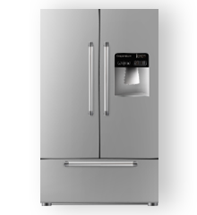
                    

                    
                    

                      <h2 class="text">응원이 필요한 순간, 나만 빼고 원하는</h2>
                      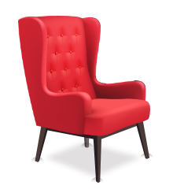
                    

                    
                    

                      <h2 class="text">위로가 필요한 순간, 나만 빼고 원하는</h2>
                      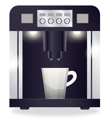
                    

                    
                

                

                    
을 받고 있다는 사실!

                    <h3>#십시일반 결제 방식으로 선물 부담이 사라집니다</h3>
                

                 
                

                     
                     
                     
                

            </article>
        </section>
        <section class="section02">
            

                <article class="article app-introduction01">
                    

                        

                            <h2>정말 필요한 선물, 위콩으로 부담없이 알려요.</h2>
                            <h3>이벤트 초대와 알림은 쉽게, 받고 싶은 선물은 실속있게</h3>
                        

                        

                    

                    

                        

                            <h2>가격 고민 없이 선물하기, 위콩에서 동참해요.</h2>
                            <h3>어디서든 실시간으로 축하, 선물 동참은 천원부터 얼마든지 자유롭게</h3>
                        

                        

                    

                    

                        <button class="btn-google clearfix" type="button">
                            
                            <a target="_blank" href="http://bit.ly/weecong-playstore">지금 바로 다운로드 Google Play</a>
                        </button>
                        <button class="btn-apple" type="button">
                            
                            <a target="_blank" href="http://bit.ly/weecong-appstore">지금 바로 다운로드 App Store</a>
                        </button>
                    

                </article>
            
 
            <article class="article app-introduction02">
                <h2>위콩, 누가 쓰나요?</h2>
                

                    

                        <h3>내인생주연파</h3>
                        
                        <h4>내 인생의 주인공은 나, 축하 이벤트는 내가 직접 기획하고 받고 싶은 선물도 내가 정한다!</h4>
                    

                    

                        <h3>인기의핵중심파</h3>
                        
                        <h4>늘 주변에 친구가 함께하는, 사회성 넘치는 그대, 선물 동참러 인원수 갱신에 도전!</h4>
                    

                    

                        <h3>실속실용파</h3>
                        
                        <h4>천원도 소중하고, 십만원은 더더욱 소중한 그대, 내 예산도, 선물도 만족도 극대화!</h4>
                    

                

            </article>
            <article class="article app-introduction03">
                <h2>위콩, 언제 쓰나요?</h2>
                

                    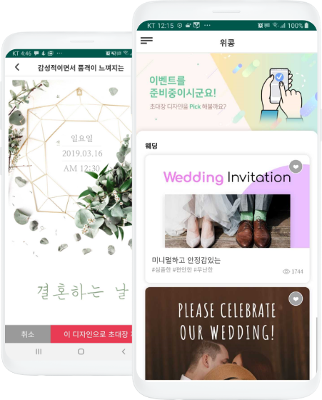
                    

                        <h3>인생의 중요한 이벤트를 준비할 때</h3>
                        <h4>인생은 이벤트의 연속! 웨딩, 집들이, 돌잔치, 베이비샤워, 브라이덜샤워, 생일, 댕댕이 퇴원 기념, 어떤 이벤트든 쉽고 편안하게 무료 초대장/청첩장, 알림을 제작하고, 지인들과의 즐거운 추억을 만드세요.</h4>
                    

                

                

                    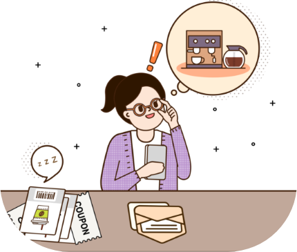
                    

                        <h3>나or소중한 사람을 위한 선물을 준비할 때</h3>
                        <h4>내 필요는 물론, 소중한 사람의 마음도 내가 잘 아니까. 초대장에 쏙 담아 보내는 희망 선물 목록으로 꼭 필요한 그 선물 받아보자구요. 사랑하는 연예인 생일엔 팬들의 마음을 모아서 선물해주는 센스발휘도 가능하다는 사실!</h4>
                    

                

                

                    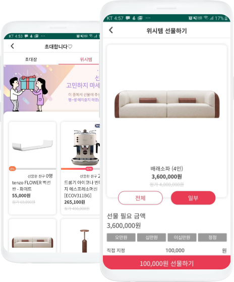
                    

                        <h3>천원이든, 십만원이든 십시일반으로 마음을 모으고 싶을 때</h3>
                        <h4>100만원 짜리 쇼파도 5만원, 10만원, 50만원, 자유롭게 마음 한자락만 보태주면 되니까 어떤 아이템도 부담없이 선물로 등록하고, 함께하는 기쁨을 누리세요. 다함께 모이면 모일 수록 부담은 Down 선물 퀄리티는 Up!</h4>
                    

                

                

                    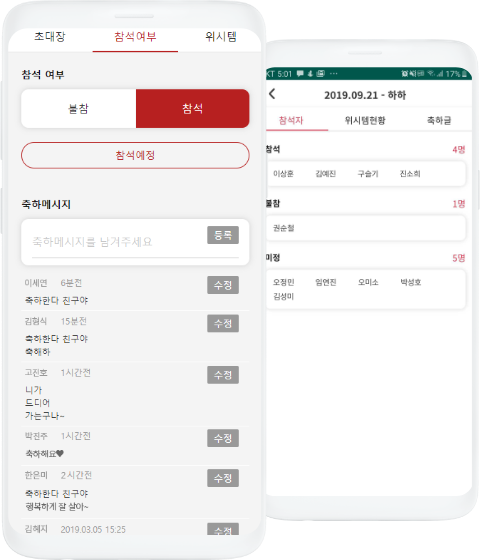
                    

                        <h3>이벤트 참석 인원수, 참석 명단 관리가 필요할 때</h3>
                        <h4>초대하는 사람 입장에서는 참서자 숫자, 감동적인 축하 메시지 한 줄, 선물 결제 여부, 배송 여부, 무엇하나 중요하지 않은 게 없으니까요. 여러분은 맘편히 초다장만 보내세요. 실시간 RSVP(참석, 불참) 관리, 참석자 명단 확인은 기본이에요.</h4>
                    

                

                

                    <button class="btn-google clearfix" type="button">
                        
                        <a target="_blank" href="http://bit.ly/weecong-playstore">지금 바로 다운로드 Google Play</a>
                    </button>
                    <button class="btn-apple" type="button">
                        
                        <a target="_blank" href="http://bit.ly/weecong-appstore">지금 바로 다운로드 App Store</a>
                    </button>
                

            </article>
        </section>
        <section class="section03">
            <article class="article">
                <h2>엄선된 브랜드 상품, 입점 진행 중</h2>
                

                    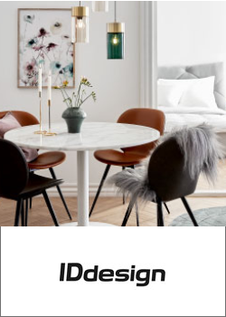
                    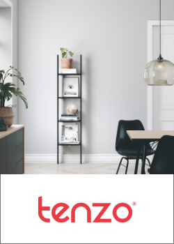
                    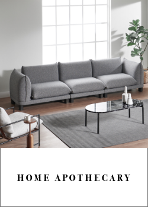
                    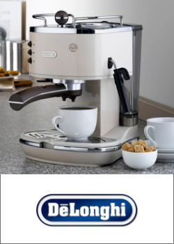
                

                

                    <button class="btn-recommend" type="button">
                        <a target="_blank" href="https://forms.gle/apKk6i3b5cWWoVUL6">선호 브랜드 추천하기</a>
                    </button>
                    <button class="btn-inquiry" type="button">
                        <a target="_blank" href="https://forms.gle/8Bdei4LUX2W7kUzK8">입점 제휴 문의 하기</a>
                    </button>
                

            </article>
        </section>
    

    <footer class="footer">
        <section class="footer-area">
            <article class="article clearfix">
                <ul class="company">
                    <li>(주)위콩랩스  (07299) 서울 영등포구 경인로 775 에이스하이테크시티 4동 405호</li>
                    <li>대표 오정민  |  사업자등록번호 465-86-01189  |   통신판매업신고번호 제2019-서울강남-02658호</li>
                    <li>입점제휴문의 partner@weecong.com  |  고객센터 support@weecong.com  | Tel  070-7405-0120 (10:00~18:00)</li>				
                </ul>
                

                    
                    
                    
                

            </article>
        </section>
    </footer>
    
    
    
    
</body>
</html>